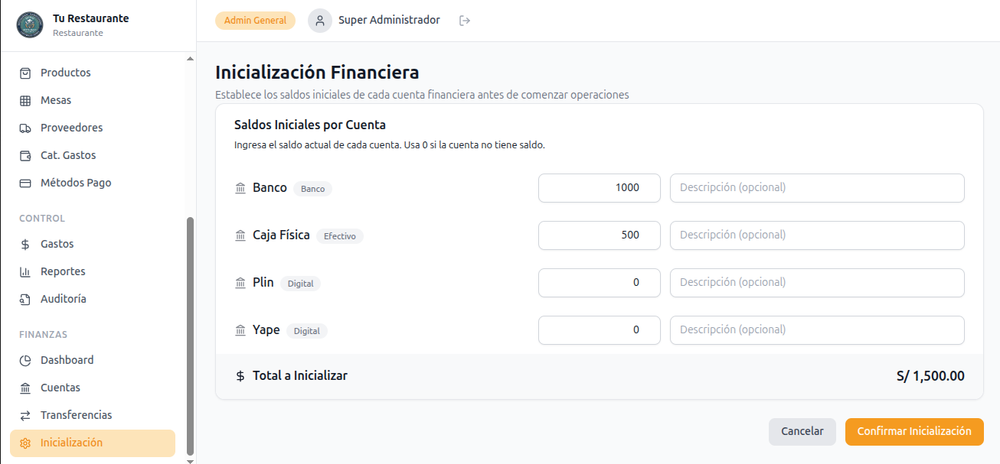
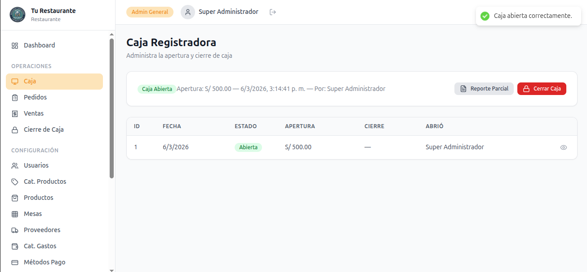
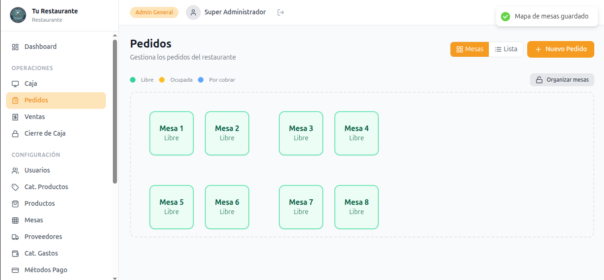
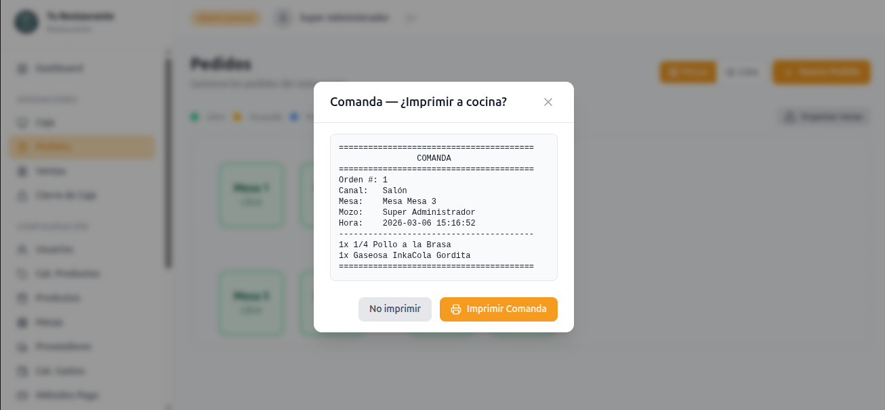
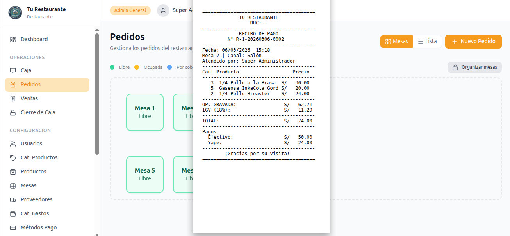
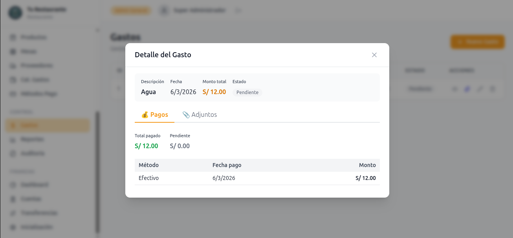
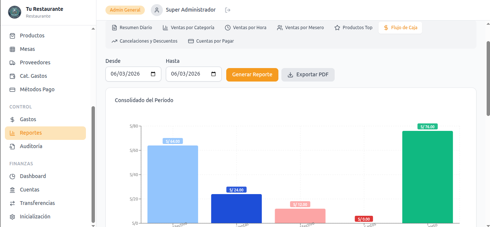
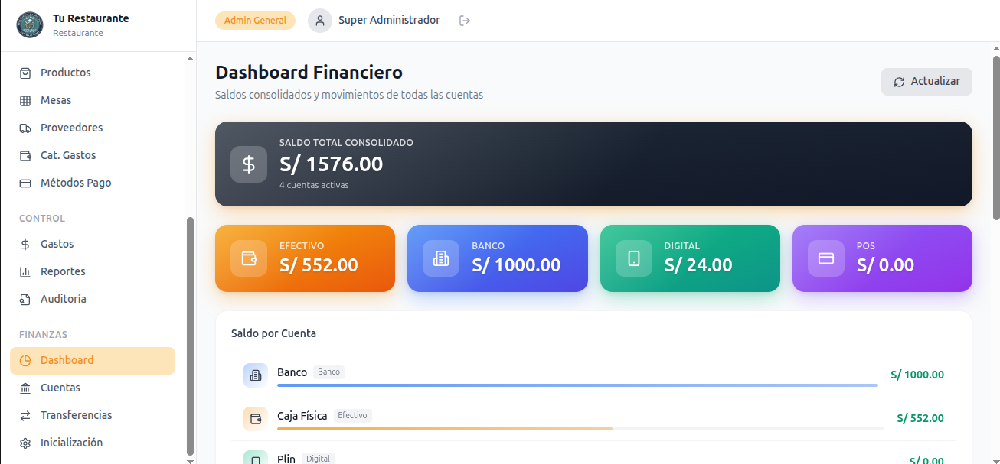
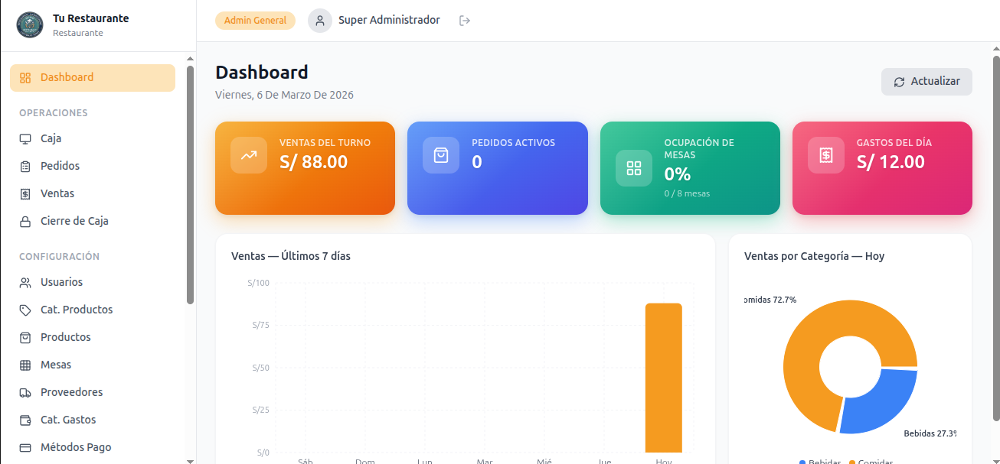

# Fullstack restaurant management system built with:

- Laravel (REST API)
- React + Vite (SPA)
- MySQL

The platform manages the full operational and financial workflow of a restaurant:
orders → sales → expenses → cash register → financial reports.

# Frontend — Sistema de Gestión para Restaurantes

SPA construida con **React 18 + Vite** para operar el ciclo diario de un restaurante sobre una API REST en Laravel.

La aplicación cubre autenticación, operación de pedidos, ventas, caja, administración, finanzas, auditoría y reportes, con control de acceso por rol y contexto de restaurante seleccionado.

---

## Tabla de Contenidos

- [Resumen Ejecutivo](#resumen-ejecutivo)
- [Arquitectura del Frontend](#arquitectura-del-frontend)
- [Stack Tecnológico](#stack-tecnológico)
- [Módulos Funcionales](#módulos-funcionales)
- [Rutas y Control de Acceso](#rutas-y-control-de-acceso)
- [Autenticación y Sesión](#autenticación-y-sesión)
- [Integración con la API](#integración-con-la-api)
- [Visualización, Reportes y Exportación](#visualización-reportes-y-exportación)
- [Sistema UI y Estilos](#sistema-ui-y-estilos)
- [Estructura del Proyecto](#estructura-del-proyecto)
- [Variables de Entorno](#variables-de-entorno)
- [Instalación y Desarrollo Local](#instalación-y-desarrollo-local)
- [Build y Despliegue](#build-y-despliegue)
- [Convenciones de Desarrollo](#convenciones-de-desarrollo)

---

## Resumen Ejecutivo

Este frontend implementa una **Single Page Application** desacoplada que consume la API del sistema de restaurantes. Su diseño prioriza:

- **Separación por dominios funcionales**: administración, operaciones, finanzas y reportes.
- **Control de acceso por rol** desde el enrutado protegido.
- **Contexto multi-restaurante** enviando `X-Restaurant-Id` en cada solicitud.
- **Experiencia operativa rápida** mediante tablas reutilizables, formularios consistentes y notificaciones globales.
- **Escalabilidad mantenible** a través de módulos API por recurso, `AuthContext`, `ProtectedRoute` y un `useCrud` genérico.

---

## Arquitectura del Frontend

La aplicación sigue una arquitectura SPA clásica con organización por capas:

### 1. Capa de Entrada
- `src/main.jsx` monta `BrowserRouter`, `AuthProvider` y `Toaster` global.
- `src/App.jsx` centraliza todas las rutas públicas y protegidas.

### 2. Capa de Autenticación
- `src/context/AuthContext.jsx` administra:
  - usuario autenticado
  - token Bearer
  - rol actual del restaurante seleccionado
  - login / logout
  - validación de sesión al iniciar

### 3. Capa de Layout
- `src/layouts/DashboardLayout.jsx` define el shell principal con `Sidebar`, `Header` y `Outlet` para páginas internas.

### 4. Capa de Navegación Segura
- `src/components/ProtectedRoute.jsx` protege rutas autenticadas y restringe acceso según roles permitidos.

### 5. Capa de Datos
- `src/api/axios.js` define el cliente HTTP base.
- `src/api/*.js` separa las llamadas por módulo funcional.
- `src/hooks/useCrud.js` encapsula operaciones CRUD recurrentes con manejo uniforme de carga, errores y notificaciones.

### 6. Capa de Presentación
- `src/pages/**` contiene las pantallas por dominio.
- `src/components/**` reúne layout, navegación y componentes reutilizables.
- `src/components/ui/**` define primitivas visuales reutilizadas en múltiples módulos.

---

## Stack Tecnológico

| Capa | Tecnología | Versión |
|------|-----------|---------|
| Framework UI | React | 18.3.1 |
| Bundler / Dev Server | Vite | 6.0.0 |
| Routing | react-router-dom | 6.28.0 |
| HTTP Client | Axios | 1.7.9 |
| Notificaciones | react-hot-toast | 2.4.1 |
| Íconos | lucide-react | 0.460.0 |
| Gráficos | Recharts | 3.7.0 |
| Exportación visual | html2canvas / jsPDF | 1.4.1 / 4.2.0 |
| Estilos | TailwindCSS + CSS utilitario del proyecto | 3.4.15 |

---

## Módulos Funcionales

### Acceso y sesión
- Login
- Persistencia de sesión con token en `localStorage`
- Selección automática del primer restaurante disponible al iniciar sesión

### Dashboard
- Vista resumida por rol
- Dashboard administrativo con KPIs y gráficos
- Dashboard simplificado para mesero con métricas de turno
- Auto-refresh periódico

### Operaciones
- Apertura de caja
- Gestión de pedidos
- Registro de ventas
- Cierres de caja

### Administración
- Usuarios
- Categorías de productos
- Productos
- Mesas y mapa visual
- Proveedores
- Categorías de gastos
- Métodos de pago
- Gastos
- Reportes
- Bitácora de auditoría
- Mermas


### Finanzas
- Cuentas financieras
- Transferencias entre cuentas
- Dashboard financiero
- Inicialización financiera de cuentas

---

## Rutas y Control de Acceso

La aplicación define una ruta pública y un conjunto de rutas protegidas dentro del `DashboardLayout`.

### Ruta pública

| Ruta | Descripción |
|------|-------------|
| `/login` | Inicio de sesión |

### Rutas autenticadas comunes

| Ruta | Descripción |
|------|-------------|
| `/dashboard` | Dashboard principal según rol |

### Operaciones

| Ruta | Acceso | Descripción |
|------|--------|-------------|
| `/cash-registers` | `admin_general`, `admin_restaurante`, `caja` | Apertura y control de caja |
| `/orders` | `admin_general`, `admin_restaurante`, `caja`, `mozo` | Gestión de pedidos |
| `/sales` | `admin_general`, `admin_restaurante`, `caja` | Registro y consulta de ventas |
| `/cash-closings` | `admin_general`, `admin_restaurante`, `caja` | Cierre operativo de caja |

### Administración

| Ruta | Acceso | Descripción |
|------|--------|-------------|
| `/admin/users` | `admin_general`, `admin_restaurante` | Usuarios |
| `/admin/product-categories` | `admin_general`, `admin_restaurante` | Categorías de productos |
| `/admin/products` | `admin_general`, `admin_restaurante` | Productos |
| `/admin/tables` | `admin_general`, `admin_restaurante` | Mesas y layout |
| `/admin/suppliers` | `admin_general`, `admin_restaurante` | Proveedores |
| `/admin/expense-categories` | `admin_general`, `admin_restaurante` | Categorías de gastos |
| `/admin/payment-methods` | `admin_general`, `admin_restaurante` | Métodos de pago |
| `/admin/expenses` | `admin_general`, `admin_restaurante` | Gestión de gastos |
| `/admin/waste-logs` | `admin_general`, `admin_restaurante`, `cocina` | Registro de mermas |
| `/admin/reports` | `admin_general`, `admin_restaurante` | Reportes operativos y financieros |
| `/admin/audit-logs` | `admin_general`, `admin_restaurante` | Auditoría de operaciones |

### Finanzas

| Ruta | Acceso | Descripción |
|------|--------|-------------|
| `/finance/accounts` | `admin_general`, `admin_restaurante` | Cuentas financieras |
| `/finance/transfers` | `admin_general`, `admin_restaurante` | Transferencias entre cuentas |
| `/finance/dashboard` | `admin_general`, `admin_restaurante` | Dashboard financiero |
| `/finance/initialization` | `admin_general`, `admin_restaurante` | Inicialización financiera |

### Rutas auxiliares

| Ruta | Descripción |
|------|-------------|
| `/` | Redirige a `/dashboard` |
| `*` | Vista `NotFound` |

---

## Autenticación y Sesión

La autenticación se implementa con token Bearer contra la API.

### Flujo de sesión
1. El usuario envía credenciales desde `Login`.
2. `authApi.login()` devuelve token y datos del usuario.
3. El frontend almacena en `localStorage`:
   - `token`
   - `user`
   - `restaurant_id` (primer restaurante asociado)
4. Al montar la aplicación, `AuthContext` valida la sesión con `authApi.me()`.
5. Si el token expira o es inválido, la sesión se limpia y el usuario es redirigido a `/login`.

### Rol activo
El rol actual no se toma de forma global, sino del restaurante seleccionado dentro de `user.restaurants[].pivot.role.slug`. Esto permite mantener coherencia con el esquema multi-tenant del backend.

---

## Integración con la API

La comunicación con el backend está centralizada en `src/api/axios.js`.

### Comportamiento del cliente HTTP
- Usa `VITE_API_URL` como base URL.
- Envía `Authorization: Bearer <token>` si existe token.
- Envía `X-Restaurant-Id` si existe restaurante seleccionado.
- Elimina manualmente `Content-Type` cuando la petición contiene `FormData`.
- Maneja errores globales por interceptor:
  - `401`: limpia sesión y redirige al login
  - `403`: muestra mensaje de permiso denegado, excepto ciertos errores controlados del módulo financiero
  - `500`: muestra error interno del servidor
  - error de red: muestra mensaje de conexión

### Módulos API disponibles
El frontend separa las llamadas por dominio en archivos dedicados dentro de `src/api/`, incluyendo:

- autenticación
- dashboard
- usuarios
- productos
- categorías de producto
- mesas
- proveedores
- gastos
- categorías de gastos
- métodos de pago
- caja
- cierres de caja
- pedidos
- ventas
- reportes
- auditoría
- mermas
- cuentas financieras
- movimientos financieros
- inicialización financiera
- transferencias entre cuentas

Esta estructura facilita mantenimiento, pruebas manuales por dominio y escalabilidad del cliente HTTP.

---

## Visualización, Reportes y Exportación

El frontend incluye visualización de datos con `Recharts` y exportación PDF en reportes.

### Dashboard principal
La página `Dashboard` consume métricas resumidas y presenta:
- KPIs operativos
- gráfico de barras de ventas diarias
- gráfico circular de ventas por categoría
- actualización automática cada 60 segundos para perfiles aplicables

### Módulo de reportes
La página `Reports` soporta al menos los siguientes reportes:
- Resumen diario
- Ventas por categoría
- Ventas por hora
- Ventas por mesero
- Productos top
- Flujo de caja diario
- Cancelaciones y descuentos
- Cuentas por pagar

### Exportación
El módulo de reportes utiliza `html2canvas` y `jsPDF` para generar exportaciones PDF de vistas analíticas, especialmente en reportes financieros y gráficos consolidados.

---

## Sistema UI y Estilos

El proyecto mezcla utilidades de Tailwind con clases semánticas propias definidas en `src/index.css`.

### Patrones reutilizables presentes
- Botones: `btn`, `btn-primary`, `btn-secondary`, `btn-danger`, `btn-warning`
- Formularios: `input`, `label`, `field-error`
- Cards: `card`, `card-flush`
- Layout del dashboard: `dashboard__*`, `sidebar__*`, `header__*`
- Estados de carga y tablas reutilizables

### Componentes UI compartidos
En `src/components/ui/` existen componentes orientados a reutilización:
- `Alert`
- `ConfirmDialog`
- `DataTable`
- `FinancialNotInitializedBanner`
- `Modal`
- `Pagination`
- `ProductSearch`
- `Spinner`

### Hook reutilizable
`useCrud` encapsula:
- listado de registros
- creación
- edición
- eliminación
- mensajes toast
- manejo de errores `422`
- estados `loading` y `saving`

Este patrón reduce duplicación entre los módulos administrativos y operativos.

---

## Estructura del Proyecto

```text
frontend/
├── docs/
│   ├── README.md
│   └── screenshots/
├── public/
├── src/
│   ├── api/                 # Cliente HTTP y módulos por recurso
│   ├── components/          # Navegación, layout y componentes reutilizables
│   │   └── ui/              # Primitivas UI del sistema
│   ├── context/             # AuthContext
│   ├── hooks/               # useCrud
│   ├── layouts/             # DashboardLayout
│   ├── pages/
│   │   ├── admin/           # Configuración, gastos, reportes, auditoría
│   │   ├── finance/         # Cuentas, transferencias, dashboard financiero
│   │   ├── operations/      # Caja, pedidos, ventas, cierres
│   │   ├── Dashboard.jsx
│   │   ├── Login.jsx
│   │   └── NotFound.jsx
│   ├── App.jsx              # Declaración central de rutas
│   ├── index.css            # Sistema visual global
│   └── main.jsx             # Punto de entrada
├── .env.example
├── .env.production
├── package.json
├── tailwind.config.js
├── vite.config.js
└── vercel.json
```

---

## Screenshots

Las capturas de pantalla del frontend se almacenan en `frontend/docs/screenshots/`.

Galería (rutas relativas):

- Inicialización financiera

  

- Apertura de caja

  

- Mapa de mesas

  

- Impresión de comanda

  

- Recibo / Ticket

  

- Registro de gastos

  

- Reportes

  

- Dashboard financiero

  

- Dashboard operativo

  


---

## Variables de Entorno

### Desarrollo

Archivo sugerido: `.env`

```env
VITE_API_URL=http://localhost:8000/api
```

### Producción

`frontend/.env.production` usa actualmente:

```env
VITE_API_URL=/api
```

---

## Instalación y Desarrollo Local

### Requisitos previos
- Node.js >= 18
- npm >= 9
- Backend API disponible y accesible

### Instalación

```bash
cd frontend
npm install
```

### Desarrollo

```bash
npm run dev
```

La aplicación se sirve con Vite en el puerto `5173` y con `host: true`, lo que permite acceso desde red local según la configuración del entorno.

---

## Build y Despliegue

### Build de producción

```bash
npm run build
```

### Preview local del build

```bash
npm run preview
```

### Despliegue en Vercel
El archivo `vercel.json` configura un rewrite global hacia `index.html`, necesario para que el enrutado del SPA funcione correctamente en refresh directo o navegación profunda.

```json
{
  "rewrites": [
    {
      "source": "/(.*)",
      "destination": "/index.html"
    }
  ]
}
```

Para un despliegue correcto se debe configurar `VITE_API_URL` apuntando al backend publicado.

---

## Convenciones de Desarrollo

### Organización
- Una página por caso de uso principal.
- Un módulo API por recurso o dominio.
- Un layout principal para toda la zona autenticada.
- Un contexto de autenticación compartido.

### Seguridad funcional
- No se renderizan pantallas protegidas sin sesión válida.
- Las rutas sensibles validan rol permitido antes de mostrar contenido.
- El restaurante activo se propaga en cada request.

### UX transversal
- Notificaciones centralizadas con `react-hot-toast`.
- Componentes de carga compartidos.
- Tablas reutilizables con soporte de ordenamiento.
- Formularios consistentes con clases semánticas comunes.

---

## Relación con el Backend

Este frontend está diseñado para operar junto con el backend Laravel del proyecto, consumiendo endpoints REST autenticados y respetando:

- tokens Sanctum/Bearer
- aislamiento multi-tenant por restaurante
- roles por restaurante
- reglas financieras y operativas definidas en la API

Por ello, cualquier cambio contractual en endpoints, payloads, permisos o validaciones del backend debe reflejarse también en los módulos de `src/api/` y en las pantallas correspondientes.
